# WirelessPalaControl

This project uses "Palazzetti library" and a D1 Mini to control Fumis based stove.  
It allows to power On/Off, change the setPoint, change fans speed, get status/alarms/temperatures of the stove.

Native HTTP requests are available which make is fully compatible with all existing home automation plugins/apps.

Additionally, this project add MQTT protocol to monitor/control your stove in a much more efficient way.

## Stove Compatibility

Fumis Controller is used by many manufacturer for their stoves.
Here is a non-exhaustive list: 
* Palazzetti
* Jotul
* TurboFonte
* Godin
* Fonte Flamme
* Invicta
* Alpis
* Faizen
* HETA
* ...

If you have this controller in your stove, it's compatible.  
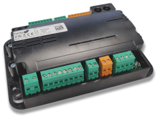

## Build your adapter

This adapter is designed to works with a D1 Mini (ESP8266) but it provides convenient header pins to use it with any other uController.

It is designed by Palazzetti using a Si8621 (Silicon Labs Isolator) to provide electrical isolation between uController and Stove electronic.  
This design uses exact same schematic and components.

### Schematic

All files are inside `schematic` subfolder and has been designed with KiCad (free and open source)  

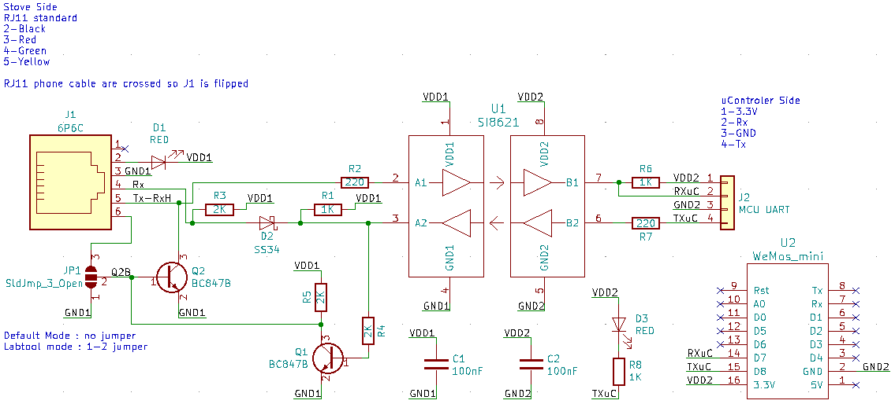

### PCB

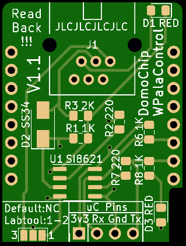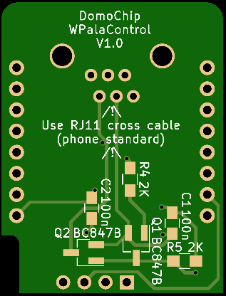  

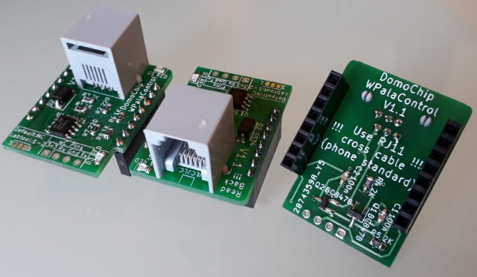  

*We produced a small batch of this adapter for test/debugging and our personal use.*  
*If you are interested, please PM.*

### Box

Box project (Fusion 360 & STL) can be found into `box` folder

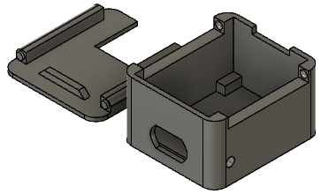

### Firmware

Source code can be compiled using VisualStudioCode/Platformio and flashed onto a D1 Mini  
Or  
Download latest release in Release section

### Connect

⚠️ **You need to use a crossed RJ11 phone cable like this:** ⚠️  
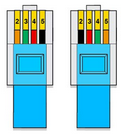

Most of stove have an RJ11/RJ12 connector for PalaControl connection.  
If you don't have it, you need to cable it using a splitter to connect screen and PalaControl at the same time :  
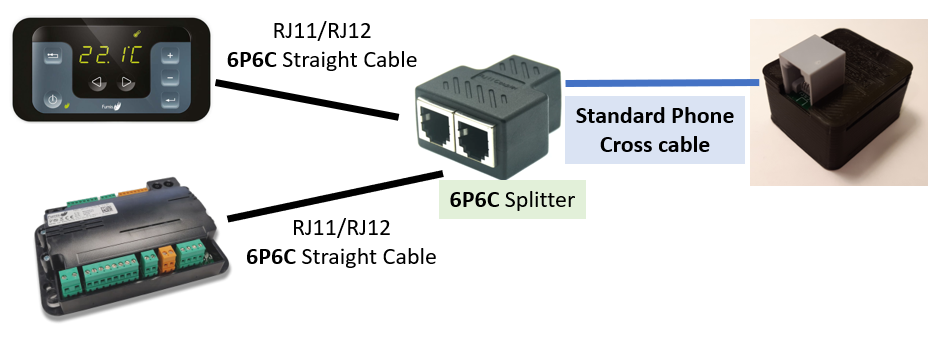

Splitter and additional cable can be found on Aliexpress (search for "6p6c splitter" and "rj12 cable").  
The splitter should correspond to this small schematic :  
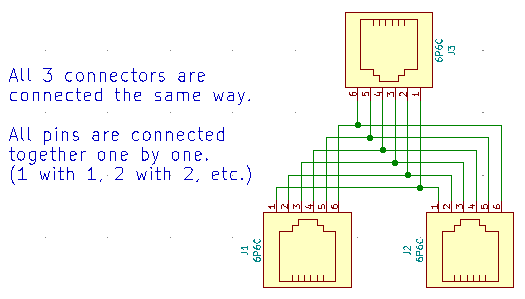

## First Boot

During First Boot, the ESP boot in Access Point Mode

- Network SSID : `WirelessPalaControlXXXX`
- Password : `PasswordPalaControl`
- ESP URL : 👉 http://wpalacontrol.local 👈

Connect to this network and then configure it.

## Configuration pages
### Status

It returns you useful informations about the module and the stove.  
**The stove SN appears then 1 minute later, refreshed stove information appears (default upload period)**  
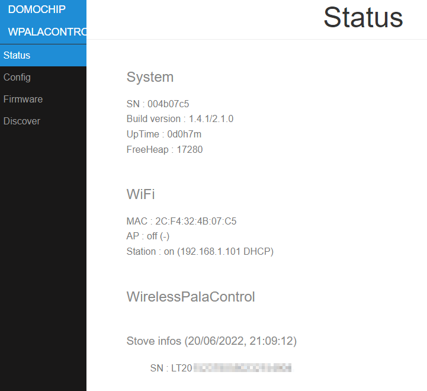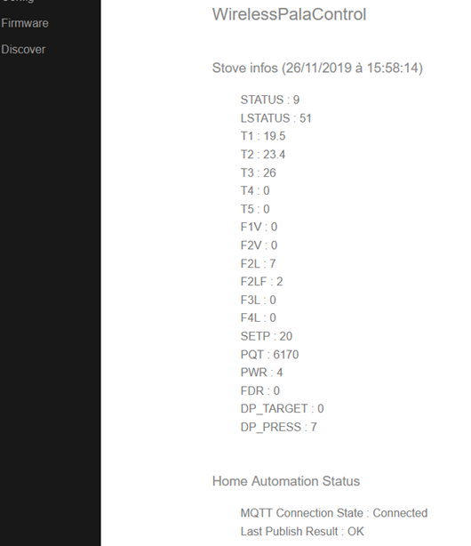

### Config

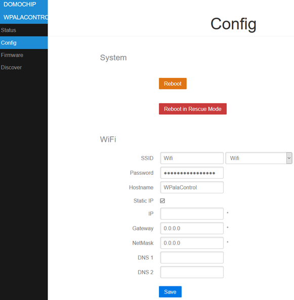  
#### WiFi:  
- **ssid & password**: IDs of your Wifi Network  
- **hostname**: name of ESP on the network  
- **IP,GW,NetMask,DNS1&2**: Fixed IP configuration  

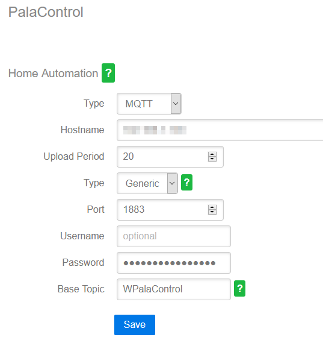  
#### PalaControl - Home Automation:  
- **Type**: enable/disable MQTT communication  
- **Upload Period**: delay between refresh of stove information (in seconds)  
- **Hostname,Port,Username,Password**: MQTT server infos (username and password are - optional)  
- **Base Topic**: prefix used for WPalaControl topic structure  
- **MQTT Type**: defines MQTT topics and data structure: 
  - **Generic**: publish raw values under the base topic (e.g. "{baseTopic}/T1" = "*20.00*")
  - **Generic JSON**: publish values JSON to "category" topic under base topic (e.g. "{baseTopic}/TMPS" = "*{"INFO":{"CMD":"GET TMPS","RSP":"OK......*")
  - **Generic Categorized**: publish raw values to "category" topic under base topic (e.g. "{baseTopic}/TMPS/T1" = "*20.00*")

### Firmware

It allows you to flash a new firmware version using `WirelessPalaControl.*.bin` file:  
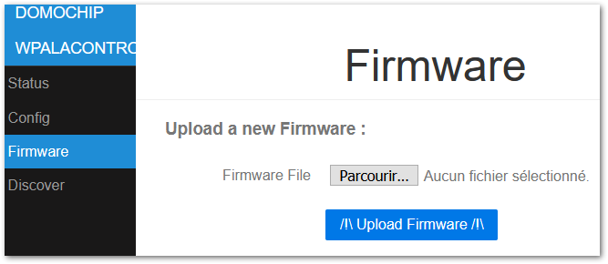

### Discover

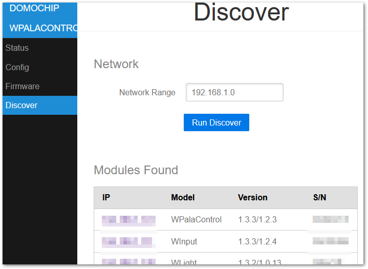

## Use it

### HTTP

Natively, HTTP GET request can be sent directly to the module.  
Syntax:  **http://wpalacontrol.local/cgi-bin/sendmsg.lua?cmd={command}**

### MQTT

Commands can be sent via MQTT to %BaseTopic%**/cmd** topic once MQTT is configured.  
Execution result is:  
 - published following the configured MQTT Type
 - published on %BaseTopic%**/result** in JSON format 

Module connection status is published to %BaseTopic%**/connected**: 
 - 0: not connected
 - 1: Module connected but no communication with the stove
 - 2: Module and stove connected

### Command List
  
- `GET+STDT`: get static data
- `GET+ALLS`: get all status data
- `GET+STAT`: get status of the stove⏲️
- `GET+TMPS`: get temperatures of the stove⏲️
- `GET+FAND`: get Fan values⏲️
- `GET+SETP`: get current Set Point (desired temperature)⏲️
- `GET+POWR`: get current power (1-5)⏲️
- `GET+CUNT`: get some counters
- `GET+CNTR`: get some counters (same as GET+CUNT)⏲️
- `GET+DPRS`: get delta pressure data⏲️
- `GET+TIME`: get stove clock data⏲️
- `GET+IOPT`: get IO ports status
- `GET+SERN`: get stove Serial Number
- `GET+MDVE`: get stove model and fw version
- `GET+CHRD`: get chrono data
- `GET+PARM+92`: get parameter (ex : 92=pellet type (1-3))
- `GET+HPAR+57`: get hidden parameter (ex : 57=% of pellet to feed for pellet type 3)
- `BKP+PARM+CSV`: get all parameters in a CSV file (HTTP only) 🔷
- `BKP+PARM+JSON`: get all parameters in a JSON file (HTTP only) 🔷
- `BKP+HPAR+CSV`: get all hidden parameters in a CSV file (HTTP only) 🔷
- `BKP+HPAR+JSON`: get all hidden parameters in a JSON file (HTTP only) 🔷
- `CMD+ON`: turn stove ON
- `CMD+OFF`: turn stove OFF
- `SET+POWR+3`: set power (1-5)
- `SET+PWRU`: increase power by 1 unit
- `SET+PWRD`: decrease power by 1 unit
- `SET+SETP+20`: set Set Point (desired temperature)
- `SET+STPF+19.8`: set Set Point with a 0.2° precision (depend of your stove model)🔷
- `SET+STPU`: increase Set Point by 1 unit
- `SET+STPD`: decrease Set Point by 1 unit
- `SET+RFAN+7`: set Room Fan value (0-5;6=Max;7=Auto)
- `SET+FN2U`: increase Room Fan by 1 unit
- `SET+FN2D`: decrease Room Fan by 1 unit
- `SET+FN3L+0`: set Room Fan 3 value (0-5)
- `SET+FN4L+0`: set Room Fan 4 value (0-5)
- `SET+SLNT+0`: set Silent mode value (0-1)
- `SET+TIME+2023-12-28+19:42:00`: set stove Date and Time (2000-2099) (1-12) (1-31) (0-23) (0-59) (0-59)
- `SET+CSST+0`: set Chrono Status value (0-1)
- `SET+CSTH+2+18`: set Chrono Program Start Hour (1-6) (0-23)
- `SET+CSTM+2+30`: set Chrono Program Start Minute (1-6) (0-59)
- `SET+CSPH+2+22`: set Chrono Program Stop Hour (1-6) (0-23)
- `SET+CSPM+2+45`: set Chrono Program Stop Minute (1-6) (0-59)
- `SET+CSET+2+19`: set Chrono Program Set Point (1-6) (desired temperature)
- `SET+CDAY+7+3+6`: set Chrono Program for week day (Day-Mem-Prog) (1-7) (1-3) (1-6)
- `SET+CPRD+1+19+18+30+22+45`: set Chrono Program data (Prog-Temp-StartH-StartM-StopH-StopM) (1-6) (temperature) (0-23) (0-59) (0-23) (0-59)
- `SET+PARM+92+2`: set parameter 92 to value 2 (ex : 92=pellet type (1-3))
- `SET+HPAR+57+95`: set hidden parameter 57 to value 95 (ex : 57=% of pellet to feed for pellet type 3)

⏲️: Published automatically  
🔷: WPalaControl specific commands

### Description

MQTT infos published every "Upload Period":
- `STATUS`: status of the stove
- `LSTATUS`: status of the stove
- `T1`, `T2`, `T3`, `T4`, `T5`: temperature of the stove
- `F1V`, `F2V`, `F2L`, `F2LF`, `F3L`, `F4L`: fan values (meaning depend of your stove model)
- `IGN`: ignition counter
- `IGNERRORS`: ignition error counter
- `POWERTIME`: total heating time (hour:minute)
- `HEATTIME`: ??? (hour:minute)
- `SERVICETIME`: heating time since last maintenance (hour:minute)
- `ONTIME`: time from last power ON (hour:minute)
- `OVERTMPERRORS`: overtemperature error counter
- `STOVE_DATETIME`: date of the stove
- `STOVE_WDAY`: week day of the stove
- `SETP`: current Set Point (desired temperature)
- `PQT`: wood pellet consumption
- `PWR`: current power (1-5)
- `FDR`: feeder
- `DP_TARGET`: delta pressure target
- `DP_PRESS`: actual delta pressure